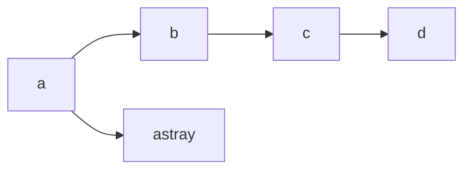

# a_star

Implements the [A\* path search/traversal algorithm](https://en.wikipedia.org/wiki/A*_search_algorithm)

The implementation defines a search method that accepts several procs/lambdas that configure the various behaviors of the search algorithm. This allows for highly customizable usage.

This gem was extracted from solutions to the [Advent of Code](https://adventofcode.com).

## Installation

Install the gem and add to the application's Gemfile by executing:

    $ bundle add a_star

If bundler is not being used to manage dependencies, install the gem by executing:

    $ gem install a_star

## Usage

### Graphs

If you had the simple graph:



you could represent it in Ruby as hash of nodes to neighbors:

```ruby
graph = {
  a: [:b, :astray],
  b: [:c],
  c: [:d],
  astray: []
}
```

Then you can use `AStar.traverse` to find the path from `:a` to `:d` with:

```ruby
results = AStar.traverse(
  # Provide a starting node
  start: :a,

  # Test if this is the desired ending node `:d`
  goal: proc { |node:| node == :d },

  # Given a `node` fetch the neighbors, return an empty array for unknown nodes.
  neighbors: proc { |node:, path:| graph.fetch(node, []) }
)

p results.path
# => #<Enumerator: #<Enumerator::Generator:0x0000000000000000>:each>

p results.path.to_a
# => [:a, :b, :c, :d]
```

_NOTE:_ the `results.path` is an `Enumerator` and you must call enumerable like methods such as `each` in order to iterate the path. Alternatively you can call `to_a` to turn the enumerated result into a full array.

### Mazes

Assume you had a maze represented by this ASCII diagram.
We wish to start at "S" and end up at "E".

```
maze = <<~EOL
:::::::::::::::::::::
:S  :   : :   : :   :
::: : : : : ::: : :::
:   : : : : :     : :
::: : ::: : : ::::: :
:     : :   :     : :
: ::: : ::: ::: : : :
:   :   :   :   :   :
: ::::: ::: : : :::::
: : : :   : : :     :
: : : : : : ::: ::: :
:   :   : :       : :
::: ::: : : ::: : : :
:   :   :   : : : : :
: ::::::: ::: : ::: :
:     : :     :   : :
: : ::: : ::::: ::: :
: : : : : :     : : :
::::: : ::::: ::: : :
:                 :E:
:::::::::::::::::::::
EOL
```

You could turn this text into a 2-D array:

```ruby
maze_as_2d_grid = maze.split("\n").map(&:chars)
```

Set a starting position as an array of `row` and `col`umn. We could write code to locate the "S" in the maze or specify it's position as it is known.

```ruby
start = [1, 1]
```

Define a `goal` proc then returned `true` when the cell at `[row][col]` is `E`. Alternatively, we could compare the `row` and `col` values directly since the location of the end of the maze is a fixed position.

```ruby
goal = proc do |node:|
  row, col = node

  maze_as_2d_grid[row][col] == "E"
end
```

Define a `neighbors` proc to return all the valid neighbors of any cell. That is, all of the locations one could navigate to from `[row][col]`

Note that we do not check for out of bounds array access since our maze is nicely bordered by walls. If this were not the case we'd have to make sure we did not navigate outside the array.

```ruby
neighbors = proc do |node:, path:|
  # decompose the row/col
  row, col = node

  directions = [
    [+0, -1], # left
    [+0, +1], # right
    [-1, +0], # up
    [+1, +0]  # down
  ]

  # Generate a set of new row/col neighbors
  all_neighbors = directions.map { |delta_row, delta_col| [row + delta_row, col + delta_col] }

  # We can go anywhere that isn't a wall (":")
  all_neighbors.select { |row, col| maze_as_2d_grid[row][col] != ":" }
end
```

Finally we can call `AStar.traverse` with these `proc`s

```ruby
results = AStar.traverse(start:, goal:, neighbors:)
```

## Development

After checking out the repo, run `bin/setup` to install dependencies. Then, run `rake test` to run the tests. You can also run `bin/console` for an interactive prompt that will allow you to experiment.

To install this gem onto your local machine, run `bundle exec rake install`. To release a new version, update the version number in `version.rb`, and then run `bundle exec rake release`, which will create a git tag for the version, push git commits and the created tag, and push the `.gem` file to [rubygems.org](https://rubygems.org).

## Contributing

Bug reports and pull requests are welcome on GitHub at https://github.com/gstark/a_star. This project is intended to be a safe, welcoming space for collaboration, and contributors are expected to adhere to the [code of conduct](https://github.com/gstark/a_star/blob/main/CODE_OF_CONDUCT.md).

## License

The gem is available as open source under the terms of the [MIT License](https://opensource.org/licenses/MIT).

## Code of Conduct

Everyone interacting in the AStar project's codebases, issue trackers, chat rooms and mailing lists is expected to follow the [code of conduct](https://github.com/gstark/a_star/blob/main/CODE_OF_CONDUCT.md).
